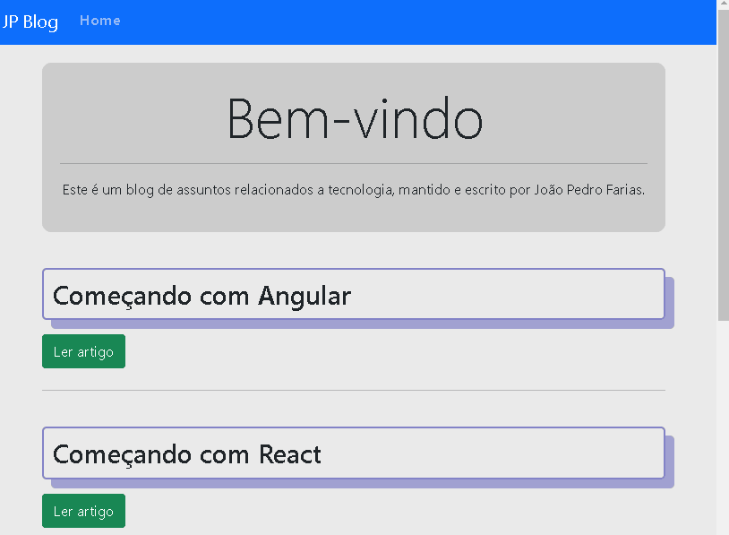
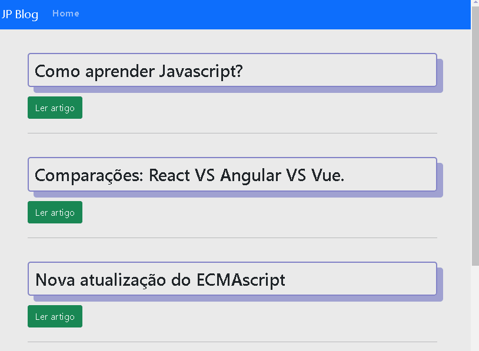
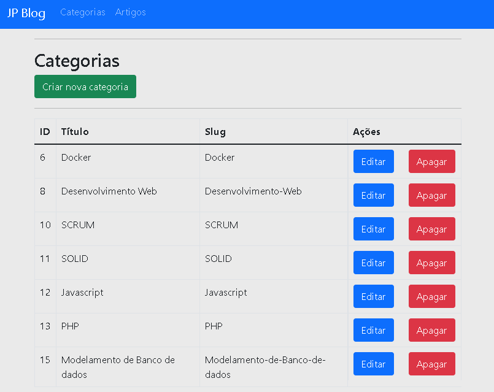
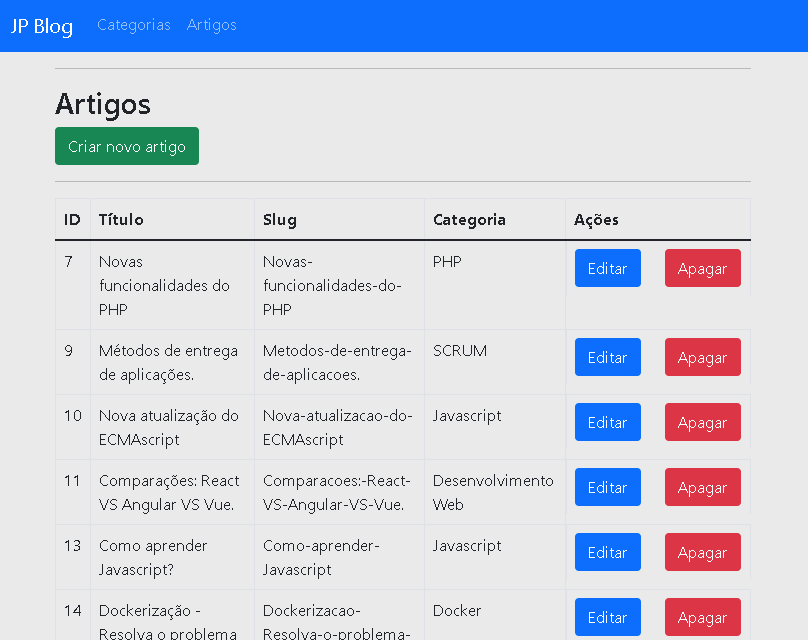
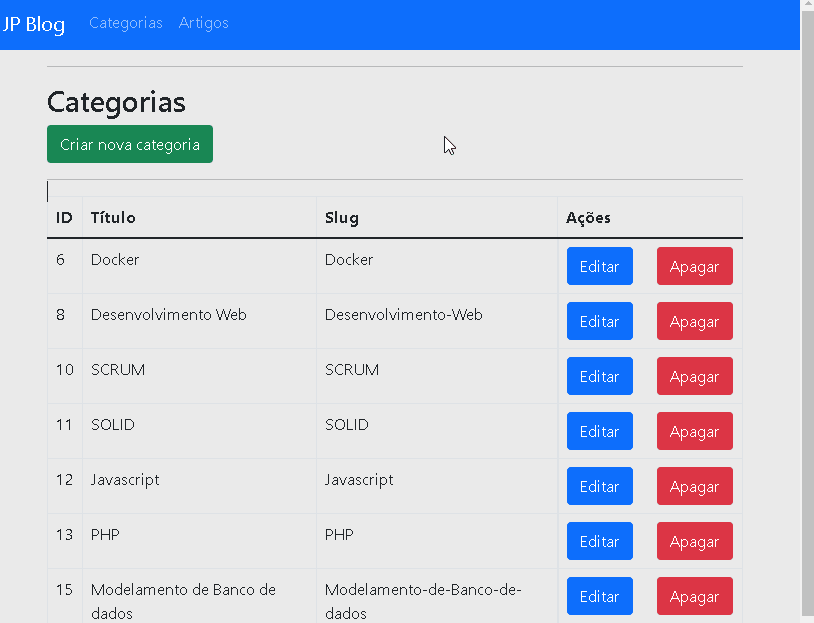
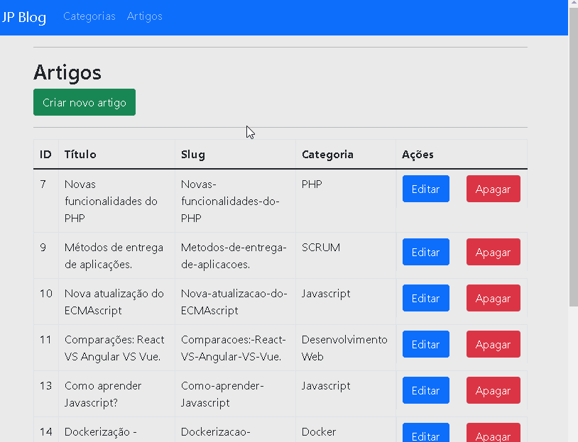

# jpblog

Este projeto trata-se de um blog completo, com área administrativa onde se pode criar artigos e categorias, além de poder atualiza-los e apaga-los no
banco de dados, ou seja um CRUD completo, seguindo a arquitetura REST Api.

 

<h4 align="center">:construction:	Projeto JPBlog 🚀 Em construção :construction:</h4>	

### Funcionalidades

- [X] Listar Artigos
- [X] Ler Artigos
- [X] Criar Artigos
- [X] Atualizar Artigos
- [X] Deletar Artigos
- [X] Páginação de Artigos
- [X] Criar Categoria
- [X] Exibir Categorias
- [X] Atualizar Categoria
- [X] Deletar Categoria
- [X] Relacionamento Categoria/Artigos
- [ ] Pesquisa por categoria
- [ ] Formulário de cadastro
- [ ] Listagem de usuários
- [ ] Autenticação
- [ ] Estilo do Blog

 

<h1 align="center">
    
</h1>
<h1 align="center">
    
</h1>
<h1 align="center">
    
</h1>
<h1 align="center">
    
</h1>
<h1 align="center">
    
</h1>
<h1 align="center">
    
</h1>
 
### Pré-requisistos
 
### Tecnologias

---

Made with :heart: by JOAOPEDROFL :hugs: [see my linkedin](https://www.linkedin.com/in/pedro-farias-79595b220/)
